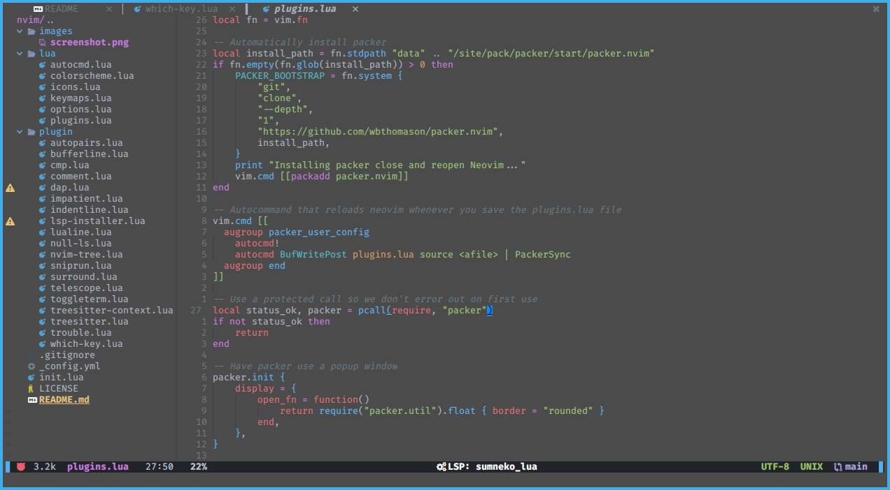

<div align = "center">

<h1><a href="https://2kabhishek.github.io/nvim">nvim</a></h1>

<a href="https://github.com/2KAbhishek/nvim/blob/main/LICENSE">
 </a>

<a href="https://github.com/2KAbhishek/nvim/graphs/contributors">
 </a>

<a href="https://github.com/2KAbhishek/nvim/stargazers">
</a>

<a href="https://github.com/2KAbhishek/nvim/network/members">
 </a>

<a href="https://github.com/2KAbhishek/nvim/watchers">
 </a>

<a href="https://github.com/2KAbhishek/nvim/pulse">
 </a>

<h3>Personalized Development Environment ❤️👨‍💻</h3>

<figure>
  
  <br/>
  <figcaption>nvim screenshot</figcaption>
</figure>

</div>

## What is this

Handcrafted neovim configs for the ultimate CLI dev experience, completely in lua

## Inspiration

Have been using nvim as my editor of choice for a while, with the introduction of vim 9 and the breaking changes to viml I decided to rewrite my configs in pure lua.

## Prerequisites

Before you begin, ensure you have met the following requirements:

- You have installed the latest version of `neovim`

## Getting nvim

To get nvim, follow these steps:

```bash
git clone https://github.com/2kabhishek/nvim
ln -sfnv $PWD/nvim $HOME/.config/nvim
```

## Plugins

For a list of plugins, see the [plugins file](./lua/plugins.lua).

Hit the ⭐ button if you found this useful.

## More Info

<div align="center">

<a href="https://github.com/2KAbhishek/nvim">Source</a> | <a href="https://2kabhishek.github.io/nvim">Website</a>

</div>
