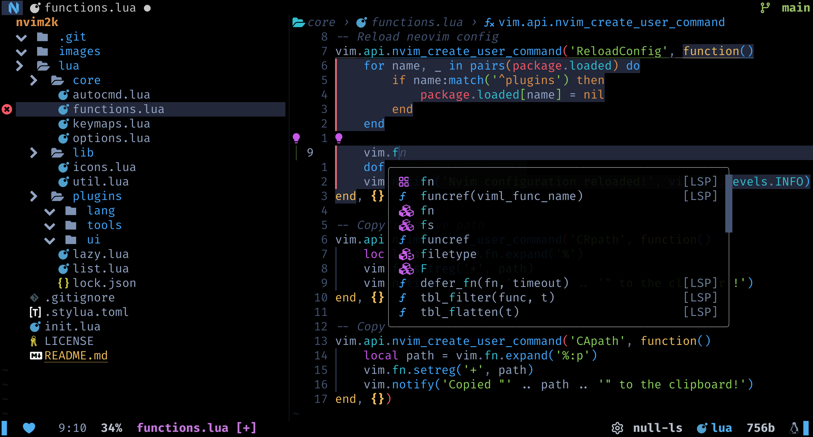

<div align = "center">

<h1><a href="https://2kabhishek.github.io/nvim2k">nvim2k</a></h1>

<a href="https://github.com/2KAbhishek/nvim2k/blob/main/LICENSE">
 </a>

<a href="https://github.com/2KAbhishek/nvim2k/graphs/contributors">
 </a>

<a href="https://github.com/2KAbhishek/nvim2k/stargazers">
</a>

<a href="https://github.com/2KAbhishek/nvim2k/network/members">
 </a>

<a href="https://github.com/2KAbhishek/nvim2k/watchers">
 </a>

<a href="https://github.com/2KAbhishek/nvim2k/pulse">
 </a>

<h3>Your Personalized Dev Env ❤️👨‍💻</h3>

<figure>
  
  <br/>
  <figcaption>nvim2k screenshot</figcaption>
</figure>

</div>

Handcrafted Neovim setup for the ultimate CLI dev experience.

Here's a [YouTube playlist](https://www.youtube.com/watch?v=Pj7jJnOcW9I&list=PL52YFor3VtLdye3d4NiLHA7h4v5_kj5_C) that contains all the videos I made related to nvim2k.

## ✨ Features

- **Fully configured LSP**: Out of the box LSP and completions, including Copilot (optional)
- **Awesome keybindings**: Intuitive and well documented keybindings with which-key
- **Blazingly fast**: Starts up in less than 30ms thanks to extensive lazy loading
- **Batteries included**: Has all the necessary plugins included out of the box
- **Git in there**: Powerful git integrations thanks to lazygit, fugitive, gitsigns and more
- **Pretty colors**: Comes with treesitter and onedark preconfigured with full transparency support
- **Goto for notes**: Comes with powerful note-taking capabilities, thanks to [tdo](https://github.com/2kabhishek/tdo)
- **Tmux integration**: Works with your tmux configurations out of the box
- **Dev tools**: Comes with debugging, testing, database and REPL support, pick and choose
- **Auto install**: All necessary LSPs, Null LS sources, Treesitter Parsers etc. are auto installed
- **User module**: Configure nvim2k according to your needs by using the `user` module!
- and some more

Most importantly:

**Built for extending**: nvim2k has a easy to understand config structure that promotes personalization, so go ahead, bring your keybindings, functions and plugins over, and truly make **nvim2k: Your Personalized Development Environment!**

## ⚡ Setup

### ⚙️ Requirements

Before you begin, ensure you have met the following requirements:

- You have installed the latest version of `neovim`
- Some command line tools: fd, ripgrep
- To use nvim2k for notes, take a look at [tdo.nvim](https://github.com/2kabhishek/tdo.nvim)

### 💻 Installation

To install `nvim2k` clone the repo and setup the symlink

```bash
git clone https://github.com/2kabhishek/nvim2k
```

On Linux and Mac

```bash
ln -sfnv $PWD/nvim2k $HOME/.config/nvim
```

On Windows Powershell

```powershell
New-Item -ItemType SymbolicLink -Path "$env:LOCALAPPDATA\nvim" -Target "$PWD\nvim2k" -Force
```

## 🚀 Usage

### 🎨 User Configs

`nvim2k` supports a user module where you can store your custom configs and override any default configs.

To use custom configs create the file `lua/user/init.lua` in nvim2k, with the following structure:

```lua
-- lua/user/init.lua
local user = {
    auto_install = true, -- enable auto install of LSPs, Treesitter parsers etc.
    user_lsp_servers = {
        -- Auto installed LSPs defined by user
    },
    user_null_ls_sources = {
        -- Auto installed Null LS sources defined by user
    },
    user_treesitter_parsers = {
        -- Auto installed Treesitter parsers defined by user
    },

    enable_db_explorer = false, -- enable dbee.nvim support
    enable_debugger = false, -- enable dap.nvim support
    enable_test_runner = false, -- enable neotest.nvim support
    enable_trainer = false, -- enable hardtime.nvim support
    user_plugins = {
        -- Add your lazy plugin spec here
    },

    user_keybindings = {
        -- Add your which-key bindings here
    }
}

return user
```

You can add and `require` any other custom modules and configurations you want in this file.

`user` module is not part of the repo, you can set up `user` module as a separate git repository while continuing to receive `nvim2k` updates.

### Core

Files in [lua/core](./lua/core/) control the core of neovim:

- [options](./lua/core/options.lua),
- [functions](./lua/core/functions.lua)
- [autocmds](./lua/core/autocmd.lua)
- [core keybindings](./lua/core/keys.lua)

### ⌨️ Keybindings

Apart from [core/keys](./lua/core/keys.lua) most keybindings are configured using [which-key](./lua/plugins/tools/which-key.lua)

### 📦 Plugins

You can check out the [plugins list file](./lua/plugins/list.lua) file to see the plugins that are included in nvim2k.

- [lang](./lua/plugins/lang/): Plugins related to language features, completions, lsp, editing etc.
- [tools](./lua/plugins/tools/): Plugins that add tool integrations to the editor.
- [ui](./lua/plugins/ui/): Plugins that make improve Neovim user experience.

## 🧑‍💻 Behind The Code

### 🌈 Inspiration

I have been using vim/neovim for 7+ years now, I wanted to share my config for everyone to use

### 💡 Challenges/Learnings

- Finding out the right plugins and configs!
- Setting up the initial config structure with lazy loading was tough.

### 🧰 Tools Used

- [dots2k](https://github.com/2kabhishek/dots2k) — Dev Environment
- [nvim2k](https://github.com/2kabhishek/nvim2k) — Personalized Editor
- [sway2k](https://github.com/2kabhishek/sway2k) — Desktop Environment
- [qute2k](https://github.com/2kabhishek/qute2k) — Personalized Browser

### 🔍 More Info

- [tdo.nvim](https://github.com/2kabhishek/tdo.nvim) — note taking system in neovim
- [termim.nvim](https://github.com/2kabhishek/termim.nvim) — enhanced neovim terminal
- [nerdy.nvim](https://github.com/2kabhishek/nerdy.nvim) — search nerdfont glyphs from inside neovim
- [co-author.nvim](https://github.com/2kabhishek/co-author.nvim) — add co authors to your git commits

<hr>

<div align="center">

<strong>⭐ hit the star button if you found this useful ⭐</strong><br>

<a href="https://github.com/2KAbhishek/nvim2k">Source</a>
| <a href="https://2kabhishek.github.io/blog" target="_blank">Blog </a>
| <a href="https://twitter.com/2kabhishek" target="_blank">Twitter </a>
| <a href="https://linkedin.com/in/2kabhishek" target="_blank">LinkedIn </a>
| <a href="https://2kabhishek.github.io/links" target="_blank">More Links </a>
| <a href="https://2kabhishek.github.io/projects" target="_blank">Other Projects </a>

</div>
